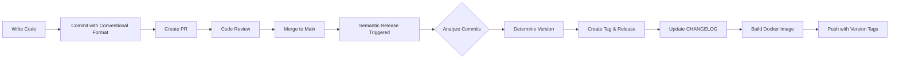

# Automated Semantic Versioning Guide

## 🤖 Fully Automated Versioning

This project uses **semantic-release** to automatically:
- ✅ Determine the next version number
- ✅ Generate release notes
- ✅ Create GitHub releases
- ✅ Update CHANGELOG.md
- ✅ Create git tags
- ✅ Trigger Docker image builds

## How It Works

### 1. Write Conventional Commits

Every commit message determines if and how the version bumps:

| Commit Type | Version Bump | Example |
|-------------|--------------|---------|
| `fix:` | **Patch** (0.0.X) | `fix: resolve null pointer exception` |
| `feat:` | **Minor** (0.X.0) | `feat: add webhook validation` |
| `BREAKING CHANGE:` | **Major** (X.0.0) | `feat!: redesign API` |
| `perf:` | Patch | `perf: improve query performance` |
| `refactor:` | Patch | `refactor: simplify controller logic` |
| `docs:`, `chore:`, `ci:`, `test:` | **No release** | `docs: update README` |

### 2. Merge to Main

When you merge a PR to `main`:
```bash
git checkout main
git pull
# Merge your PR or push commits
```

### 3. Automated Release Happens

The `semantic-release` workflow automatically:
1. **Analyzes** all commits since last release
2. **Determines** next version based on commit types
3. **Generates** changelog from commit messages
4. **Creates** git tag (e.g., `v1.2.3`)
5. **Publishes** GitHub release with notes
6. **Updates** CHANGELOG.md
7. **Triggers** Docker image build with version tags

## Commit Message Format

```
<type>[optional scope]: <description>

[optional body]

[optional footer(s)]
```

### Examples

**Patch Release (0.0.1 → 0.0.2):**
```bash
git commit -m "fix: prevent race condition in controller"
```

**Minor Release (0.1.0 → 0.2.0):**
```bash
git commit -m "feat(webhook): add custom validation rules"
```

**Major Release (1.0.0 → 2.0.0):**
```bash
git commit -m "feat!: change API response format

BREAKING CHANGE: Response structure now uses snake_case instead of camelCase"
```

**Multiple Changes in One Commit:**
```bash
git commit -m "feat: add retry mechanism and improve logging

- Implement exponential backoff for failed operations
- Add structured logging with context fields
- Update error messages for clarity

Closes #123"
```

**No Release:**
```bash
git commit -m "docs: update installation guide"
git commit -m "chore: update dependencies"
git commit -m "ci: fix workflow syntax"
```

## Version Examples

Starting from version **v1.0.0**:

| Commits Merged | Result | Notes |
|----------------|--------|-------|
| `fix: bug fix` | **v1.0.1** | Patch bump |
| `feat: new feature` | **v1.1.0** | Minor bump |
| `feat!: breaking change` | **v2.0.0** | Major bump |
| `fix: bug` + `feat: feature` | **v1.1.0** | Highest bump wins |
| `docs: update` | **No release** | No version bump |

## Docker Image Tags Generated

When semantic-release creates version `v1.2.3`, the following tags are pushed:

- `vimalvi/orchestrator-api:1.2.3` (exact version)
- `vimalvi/orchestrator-api:1.2` (minor version)
- `vimalvi/orchestrator-api:1` (major version)
- `vimalvi/orchestrator-api:latest` (if on main)

## Workflow



## Best Practices

### ✅ DO:
- Use clear, descriptive commit messages
- Group related changes in single commits
- Reference issues with `Closes #123` or `Fixes #456`
- Use `feat!:` or add `BREAKING CHANGE:` footer for breaking changes
- Write commit bodies for complex changes

### ❌ DON'T:
- Mix unrelated changes in one commit
- Use vague messages like "fix stuff" or "update code"
- Forget the colon after commit type
- Manually create version tags (let semantic-release do it)

## Advanced: Preventing Release

To commit to main without triggering a release:

```bash
# Use types that don't trigger releases
git commit -m "chore: update tooling"
git commit -m "docs: fix typo"
git commit -m "ci: update workflow"

# Or use special scope
git commit -m "feat(no-release): internal improvement"
```

## Troubleshooting

### No Release Created
- Check if commits use types that trigger releases (`feat`, `fix`, `perf`)
- Verify commits follow conventional format
- Check workflow logs in Actions tab

### Wrong Version Number
- Review commit messages - they determine version bump
- Use `git log --oneline` to see recent commits
- Breaking changes require `BREAKING CHANGE:` in footer or `!` after type

### Need Manual Release
Use the manual release workflow:
1. Go to **Actions** → **Manual Release (Backup)**
2. Click **Run workflow**
3. Enter version tag (e.g., `v1.0.0`)

## Configuration Files

- [.releaserc.json](.releaserc.json) - Semantic release configuration
- [.github/workflows/semantic-release.yml](.github/workflows/semantic-release.yml) - Automation workflow
- [.github/workflows/ci.yml](.github/workflows/ci.yml) - CI/CD with image builds

## Learn More

- [Conventional Commits](https://www.conventionalcommits.org/)
- [Semantic Versioning](https://semver.org/)
- [Semantic Release Docs](https://semantic-release.gitbook.io/)
